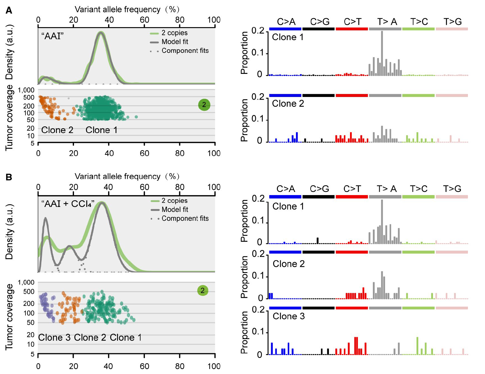
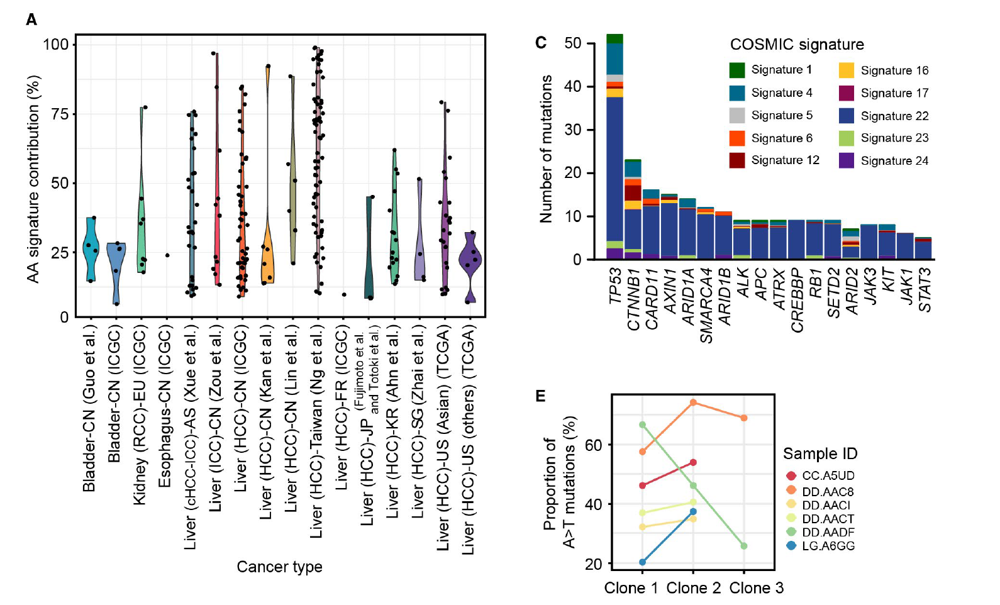

## This github repository contains all code that is necessary to reproduce the results for our [Hepatology 2019 paper](https://aasldpubs.onlinelibrary.wiley.com/doi/full/10.1002/hep.30863):

### "The Mutational Features of Aristolochic Acid–Induced Mouse and Human Liver Cancers", Hepatology, 2019. 

### Content
./GenomeExome-seq_Mutation: scripts for processing mouse liver cancer WES data and call somatic mutations;

./Sciclone: scritps for performing tumor clonal analyses based on VAF and CNV;

./MutationSignatureBootstrapping: 
scripts for deconvoluting mutational signature with bootstrapping resmapling method; tumor mutation siganture content simulation; plotting mutation signature.

./CNV:scripts for shallow-depth WGS based CNV analysis

### Data availability
The mouse WES, low-depth WGS and RNS-seq data used in the manuscript can be downloaded from the database of NCBI under accession number: PRJNA1069 507339. Processed data can be provided upron request.

The munascript also contains analyses on the following open human liver cancer WES/WGS data:

| Data Source Regions	| Number of patients | Cancer type | Data source |
| ------------- | ------------- |------------- |------------- |
| China (mainland)   | 313  | HCC | ICGC |
| China (Hong Kong)| 	88 | HCC |	Kan Z, et al, Genome Res 2013;23:1422-1433. |
| China (mainland) | 	116 | HCC |	Lin DC, et al, Cancer Res 2017;77:2255-2265. |
| China (Taiwan) |	98 |	HCC | Ng AWT, Sci Transl Med 2017;9:eaan6446. |
| USA (Asian ethenity) | 	160	| HCC | TCGA, Cell 2017;169:1327-1341. |
| USA (others)| 	204	| HCC |TCGA, Cell 2017;169:1327-1341. |
| France |	249 |HCC |	ICGC; Letouze E, et al NatCommun 2017;8:1315. |
| Japan| 	594 |	HCC | ICGC; Fujimoto A, et al, Nat Genet 2016;48:500-509. & Totoki Y, et al, Nat Genet 2014;46:1267-1273. |
| Singapore| 	9	| HCC | Zhai W, et al, Nat Commun 2017;8:4565. |
| Korea |	231	| HCC | Ahn SM, et al, Hepatology 2014;60:1972-1982. |
| China (mainland)	| 103 | ICC |	Zou S, et al, Nat Commun 2014;5:5696. |
|Asia|	121	| cHCC-ICC | Xue R, et al, Cancer Cell 2019;35:932-947. |

